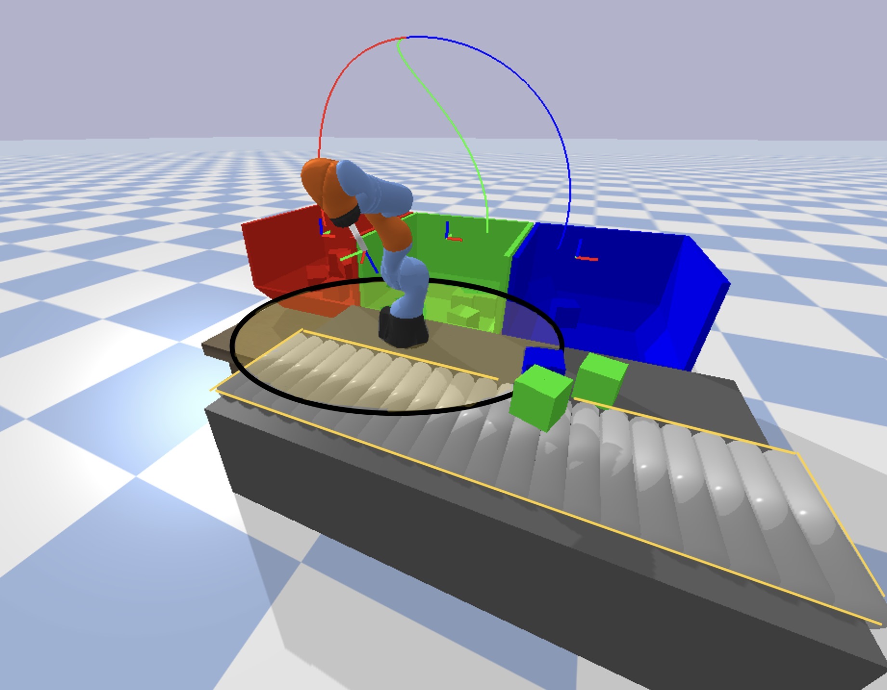

# Autonomous Robotics – Planning and Control

This course delves into the essential principles of autonomous robotics, focusing on the development of systems capable of performing tasks with minimal human supervision. Key topics include the robot’s ability to perceive its environment, determine its location, identify and avoid obstacles, and compute and follow a trajectory to reach a specified destination. The course covers the operation of sensors and actuators, foundational concepts in control and planning, and critical aspects of localization, sensing, and perception necessary to achieve robotic autonomy.

## Key Modules

The course is organized around key questions central to autonomous robotics:

1. **How to develop a mathematical representation of robot motion?**
2. **How to design feedback systems to control robots?**
3. **How to plan and compute trajectories for robots to perform given tasks?**

## Learning Outcomes
- **Modeling dynamics** of robotic systems.
- **Designing planning and control algorithms** for autonomous robots.

## Course Project:

**LQR Controller**: Design a Linear Quadratic Regulator (LQR) controller to provide optimal control for the manipulator during the pick and place process.
**PRM Trajectory Generator**: Implement a Probabilistic Roadmap (PRM) trajectory generator to efficiently plan collision-free paths for the manipulator to follow while picking and placing cubes.
**Task Allocator**: Develop a task allocation algorithm to intelligently assign the pick and place tasks to the manipulator, considering the cube's color and drop-off locations.

Design a LQR controller \( u = Kx \), where \( K = (K_1, K_2) \)

$$
\tau = M(\theta)\bar{\tau} + V(\theta, \dot{\theta}) + G(\theta)
$$

$$
\tau = M(\theta)(K_1\theta + K_2\dot{\theta}) + V(\theta, \dot{\theta}) + G(\theta)
$$

Given a reference trajectory \( \theta_{\text{ref}} \), \( t > 0 \), design a controller for trajectory tracking:

$$
\mathbf{x}_{\text{ref}} = 
\begin{pmatrix}
\theta_{\text{ref}} \\
\dot{\theta}_{\text{ref}}
\end{pmatrix},
\quad
\dot{\mathbf{x}}_{\text{ref}} = 
\begin{pmatrix}
\dot{\theta}_{\text{ref}} \\
\ddot{\theta}_{\text{ref}}
\end{pmatrix}
$$

Define the system's dynamics as a matrix equation:

$$
\dot{\mathbf{x}}_{\text{ref}} = 
\begin{pmatrix}
0 & I \\
0 & 0
\end{pmatrix}
\mathbf{x}_{\text{ref}} +
\begin{pmatrix}
0 \\
I
\end{pmatrix}
u_{\text{ref}}
$$

Define $$ \bar{x} = x - x_{\text{ref}} $$ and $$ \bar{u} = u - u_{\text{ref}} $$. Then we can design a controller using LQR. We can compute the $$ K $$ matrix using the **control** library in **Python** and apply the control input $$ \bar{u} = K\bar{x} = K_1(\theta - \theta_{\text{ref}}) + K_2(\dot{\theta} - \dot{\theta}_{\text{ref}})$$.

## Key Topics:

### 1. Introduction to Robotics
- Overview of mobile robots and robotic manipulators.
- Introduction to computational tools critical for robotics research, including nonlinear optimization packages, the Robot Operating System (ROS), and physics simulators.

### 2. Basic Concepts and Review
- Understanding of configuration space and state space representation.
- Exploration of holonomic versus non-holonomic systems, and the distinction between underactuated and fully actuated systems.
- Review of essential calculus and linear algebra concepts relevant to robotics.

### 3. Robot Kinematics
- Physics underlying robotic systems and coordinate transformations.
- Detailed examination of the kinematics of mobile robots and robotic manipulators.

### 4. Robot Dynamics
- Introduction to Newton-Euler methods and the Lagrange method for dynamic modeling.
- Analysis of the dynamics of mobile robots and manipulators, emphasizing the principles of motion and force interactions.

### 5. Robot Control
- Techniques for ensuring stability in robot dynamics and designing state feedback systems.
- Approaches for path and trajectory following, incorporating obstacle avoidance strategies to ensure safe and efficient robot navigation.

### 6. Motion Planning
- Exploration of graph search algorithms and Rapidly-Exploring Random Trees (RRT) for motion planning.
- Techniques for trajectory optimization and the integration of learning-based planning methods.
- Application of motion planning in robot navigation and manipulation tasks.

### 7. Localization
- Overview of sensors used for robot localization and methods for modeling uncertainty.
- Introduction to particle filters and Kalman filters, as well as sensor fusion techniques to enhance localization accuracy.

### 8. Sensing and Perception
- Fundamentals of maps and environment representation, and the basics of robot sensing and object recognition.
- Principles of simultaneous localization and mapping (SLAM), and the challenges of real-time motion planning in dynamic environments.
